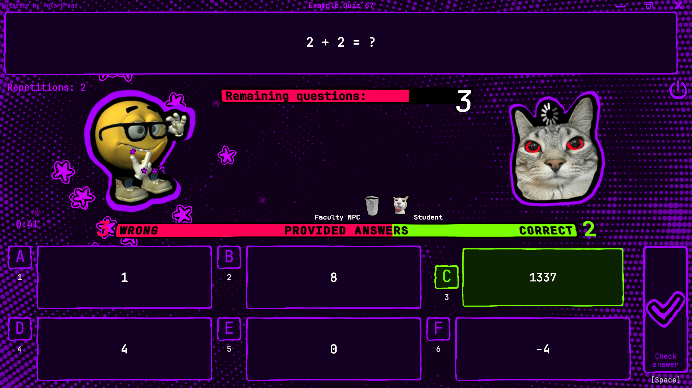
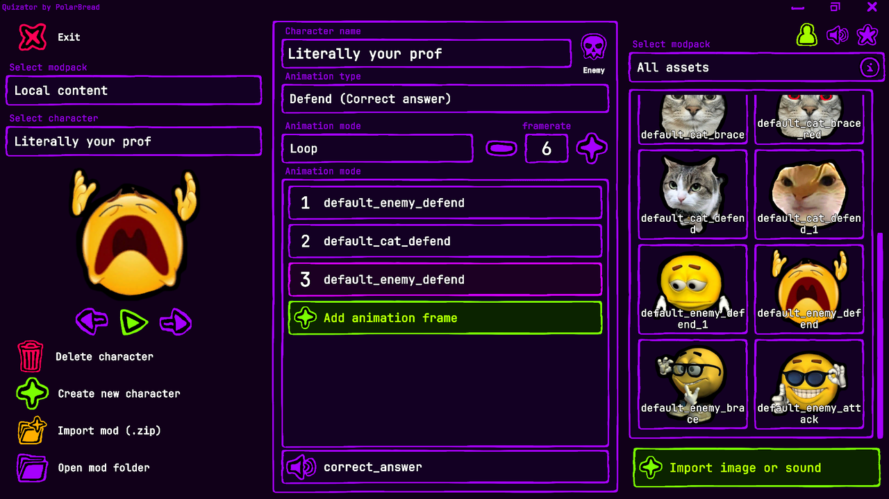

# Testownixator!! || QuizBattler ⚔️

> An interactive, gamified study application that transforms tedious exam question drilling into animated battle encounters.

   

---

## 📌 Overview

**Testownixator!! || QuizBattler** is a desktop study application designed to combat study fatigue during exam preparation. Instead of traditional flashcards, the app embeds you typical study workflow into an animated battles.

Built with user-experience and customization in mind, the application supports legacy question bank formats, custom user mods, and intuitive desktop window controls.

---

## ✨ Key Features

### 🎮 Gamified Exam Drilling
* **Combat-Driven Learning:** Questions power real-time battle interactions. Correct answers trigger character action animations and sound effects, turning exam sets into boss fights.
* **Custom Character & Asset Modding:** Mod support allowing users to load custom sprites and sounds for opponents.

### 📄 Interoperability & File Support
* **Testownik Compatibility:** Native parser support for modern json format as well as legacy **testownik** files, ensuring zero migration friction for existing question banks.
* **In-App Quiz Creator & Importer:** Built-in editor to create, edit, or import text-based flashcard sets and share them with peers.

### 💻 Custom UX & Window Management
* **Linux-Style Window Control:** Implements ***alt + middle-mouse / right-mouse*** drag-and-resize mechanics directly within the application viewport for fast workspace adjustments.

---

## 🚀 Quick Start & Download

1. Download the latest build from the **[Itch.io Release Page](https://polarbread.itch.io/quizator)**.
2. Extract the `.zip` archive to your preferred location.
3. Launch `Quizator.exe`.

> ℹ️ **Windows Defender / SmartScreen Notice:**  
> Because this application is independently built and lacks an expensive Code Signing Certificate, Windows SmartScreen may display an *"Unknown Publisher"* warning on initial launch.  
> * To run: Click **More Info** ➔ **Run Anyway**.  
> * Feel free to inspect or scan the executable before running.

---

## 🛠️ Architecture & Modding

The project follows a modular structure decoupling question state management from the rendering engine:

* **Parser Engine:** Handles text serialization/deserialization across custom JSON schemes and legacy Testownik file structures.
* **Asset & Character System:** Features an in-app character creator along with a dynamic asset loading pipeline supporting `.png` graphics, `.mp3` / `.ogg` audio files, and modular sprite configuration.
* **Battle Controller:** Animates characters and plays sounds after 
* **Custom Window Input Handler:** Intercepts mouse events to provide Linux-like window dragging and resizing without relying on default OS borders.

---

## ⚖️ Disclaimer & Compliance

This software is an independent study tool. User-created content, uploaded question banks, and custom visual mods are the sole responsibility of the individual user. Please ensure all question sets and custom characters comply with local academic integrity standards and copyright laws.
